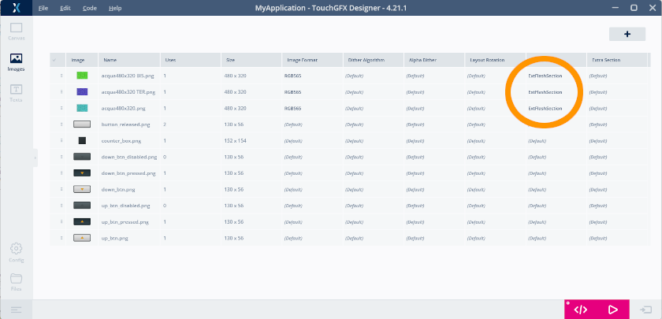
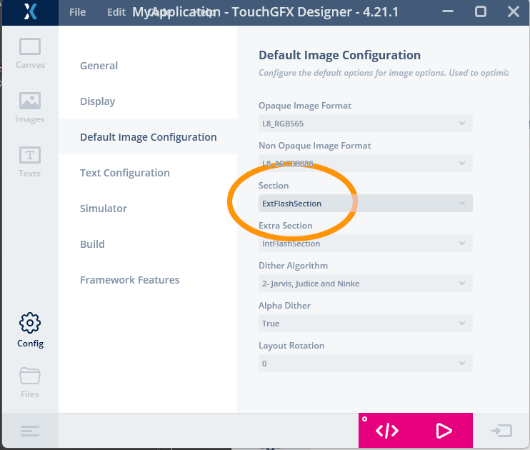
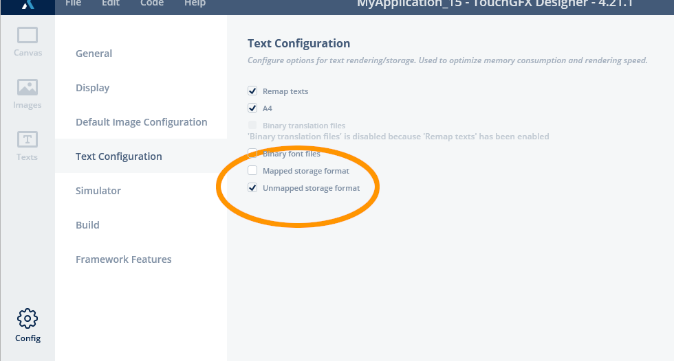

**Piu' sotto, al termine della lingua inglese trovi il testo in italiano. </i>**_
_**<br>Below the English text you'll find the Italian version</i>**_
<br>
<br>
<br>

# 4) "How to" setup a TouchGFX project mapping an external flash memory

Setup a TouchGFX project (following https://github.com/maudeve-it/ILI9XXX-XPT2046-STM32)<br>
then:<br>
<li><b>on CubeMX</b>:<br>
<ul>
on TouchGFX package:
<ul>
enable <b>"External Data Reader"</b>	
<ul>
in <b>External data reader: Memory base address</b>
<ul>	
set the memory base address (leave 0x90000000 if no specific needs t ochange it)
</ul>	
in <b>External data reader: Memory size</b>
<ul>	
indicate the size of the external flash memory
</ul>	
other parameters
<ul>	
leave unchanged
</ul>	
</ul>	
</ul>	
generate "c" code.
</ul>	
<li><b>on CubeIDE</b>:<br>
<ul>
in <i><b>include</b></i> folder, copy file:
<ul>
z_flash_W25QXXX.h<br>
</ul>
in <i><b>src</b></i> folder, copy file:
<ul>
z_flash_W25QXXX.c<br>
</ul>
in <i><b>root</b></i> folder, copy files:
<ul>
Program_linker_include.txt<br>
</ul>
Edit file <i>main.h</i>:
<ul>
open it<br>	
modify <i>/* USER CODE BEGIN Includes */</i> segment, adding the flash library include, this way:
<br>
<ul>

```sh
(main.h)
...
/* Private includes ----------------------------------------------------------*/
/* USER CODE BEGIN Includes */
...
#include "z_flash_W25QXXX.h"
...
/* USER CODE END Includes */
...
```

<br>

</ul>
</ul>

<ul>
<b>Edit the linker script</b> (<xxxxxxxx_FLASH.ld</b> file):<br>
<ul>
<li>open the linker script file and open also Program_linker_include.txt<br>
<li>from this last file copy the row indicating flash size and address (starting with "SPI_FLASH...")<br> 
<li>in the linker script, in the "<b>Memories definition</b>" area, paste the copied row, obtaining something like this:<br>  

```sh
(xxxxxxFLASH.ld)
...
/* Memories definition */
MEMORY
{
  RAM    (xrw)    : ORIGIN = 0x20000000,   LENGTH = 128K
  FLASH    (rx)    : ORIGIN = 0x8000000,   LENGTH = 512K
  SPI_FLASH    (r)    : ORIGIN = 0x90000000,   LENGTH = 1M
}
...
```
<br>
	
<li><b>Do not modify</b> RAM configuration,FLASH one or anyother memory area defined and handled by CubeMX<br>
<li>Change "LENGTH" field <b>of SPI_FLASH</b> indicating the size of flash memory you are using<br>
<li>"ORIGIN" field of SPI_FLASH <b>must be the same value</b> registred in CubeMX TouchGFX configuration<br> 

</ul>
from Program_linker_include.txt file copy rows of the <b>ExtFlashSection</b><br>

```sh
(Program_linker_include.txt)
...
  ExtFlashSection :
  {
	*(ExtFlashSection ExtFlashSection.*)
	*(-gnu-linkonce.r.*)
    . = ALIGN(0x100);
  } >SPI_FLASH
...
```

<ul>
and paste them at the beginning of the SECTIONS area of the linker script. This way:<br>

```sh
(xxxxxxFLASH.ld)
...

/* Sections */
SECTIONS
{
  ExtFlashSection :
  {
	*(ExtFlashSection ExtFlashSection.*)
	*(-gnu-linkonce.r.*)
    . = ALIGN(0x100);
  } >SPI_FLASH
...
```
<ul>
this will allow to move selected images to the external flash memory.

if you want/need to move also fonts to the external memory copy also the  <b>FontFlashSection</b> from Program_linker_include.txt and paste into linker file this way:

```sh
(xxxxxxFLASH.ld)
...

/* Sections */
SECTIONS
{
  ExtFlashSection :
  {
	*(ExtFlashSection ExtFlashSection.*)
	*(-gnu-linkonce.r.*)
    . = ALIGN(0x100);
  } >SPI_FLASH

  FontFlashSection :
  {
    *(FontFlashSection FontFlashSection.*)
    *(.gnu.linkonce.r.*)
    . = ALIGN(0x4);
  } >SPI_FLASH

...
```
<br>

<li><b>on TouchGFX Designer</b>:<br>
<br>
<ul>
From now on, when you are in <b>TouchGFX Designer</b>, you can move single pictures to the external flash assigning them to the <b>ExtFlashSection</b>:<br><br>

<br>
<br>If you want use external flash as the default storage for pictures set it into the <b>Default Image Configuration</b>:<br>
<br>

</ul>
If you move fonts over the external flash memory, you <b>ALWAYS MUST</b> set fonts as "unmapped" in <b>TouchGFX Designer</b> configuration:<br>
<br>

<br>
<br>

---
>
> <i><b>WARNING</b></i>
> </b>
> External SPI flash memory is MUCH slower than uC internal flash.<br> 
> Consider to move to the flash what you really need due to the limit of the uC internal flash

---

<br>
<li> add the external loader to CubeIDE
<ul>	
Go to the STM32CubeIDE program folder
(right-click the program icon and choose "open file location")<br>
once in the STM32CubeIDE program folder go to:
<ul>
<i>plugins</i> folder<br>
<i>xxxxxx.externaltools.cubeprogrammer.xxxxx</i> folder<br>
<i>tools</i> folder<br>
<i>bin</i> folder<br>
<i>ExternalLoader</i> folder<br>
</ul>
here copy the external loader you previously made following above instructions<br>
</ul>
<li>configure CubeIDE to use the external loader<br>
<ul>
in CubeIDE go to Project->Properties->Run/Debug Settings<br>
select the settings file and click "Edit"<br>
go to "Debugger"<br>
scroll to "External Loaders" and click "Add"<br>
select, in the external loader list, the external loader to use.
Click "OK" and "Apply" until you close all the "properties" windows open.
	
</ul>	
<br><i><b>
<br>

[Back to the home page](../.)

</b></i><br>

<br>

---

---

<br>
<br>

# "How to" come configurare un progetto TouchGFX mappando una memoria flash esterna 
Configurare un progetto TouchGFX (segui ad esempio  https://github.com/maudeve-it/ILI9XXX-XPT2046-STM32)<br>
poi:<br>
<li><b>in CubeMX</b>:<br>
<ul>
nel pacchetto TouchGFX:
<ul>
abilitare <b>"External Data Reader"</b>	
<ul>
in <b>External data reader: Memory base address</b>
<ul>	
impostare l'indirizzo dove mappare la memoria (lasciare 0x90000000 se non si anno specifiche esigenze diverse)
</ul>	
in <b>External data reader: Memory size</b>
<ul>	
indicare la dimensione della memoria flash esterna
</ul>	
altri parametri
<ul>	
lasciare come sono
</ul>	
</ul>	
</ul>	
generare il "codice c".
</ul>	
<li><b>su CubeIDE</b>:<br>
<ul>
nella cartella <i><b>include</b></i>, copiare il file:
<ul>
z_flash_W25QXXX.h<br>
</ul>
nella cartella <i><b>src</b></i>, copiare il file:
<ul>
z_flash_W25QXXX.c<br>
</ul>
nella cartella <i><b>root</b></i>, copiare i file:
<ul>
Program_linker_include.txt<br>
</ul>
Modificare il file <i>main.h</i>:
<ul>
aprirlo<br>	
modificare il segmento <i>/* USER CODE BEGIN Includes */</i>, aggiungendo la "include" per la libreria flash:
<br>
<ul>

```sh
(main.h)
...
/* Private includes ----------------------------------------------------------*/
/* USER CODE BEGIN Includes */
...
#include "z_flash_W25QXXX.h"
...
/* USER CODE END Includes */
...
```
<br>
<ul>
<b>Editare lo script per il linker</b> (file <xxxxxxxx_FLASH.ld</b>):<br>
<ul>
<li>aprire lo script per il linker e aprire anche Program_linker_include.txt<br>
<li>da questo ultimo file copiare la riga che indica la misura e l'indirizzo della memoria flash (inizia con "SPI_FLASH...")<br> 
<li>nello script linker, nell'area "<b>Memories definition</b>", incolla la riga copiata, ottenendo una struttura come questa:<br>  

```sh
(xxxxxxFLASH.ld)
...
/* Memories definition */
MEMORY
{
  RAM    (xrw)    : ORIGIN = 0x20000000,   LENGTH = 128K
  FLASH    (rx)    : ORIGIN = 0x8000000,   LENGTH = 512K
  SPI_FLASH    (r)    : ORIGIN = 0x90000000,   LENGTH = 1M
}
...
```
<br>
	
<li><b>Non modificare</b> la configurazione RAM, FLASH, o qualunque altra riga si trovi qui: definita e gestita da CubeMX<br>
<li>Modificare il campo "LENGTH" <b>di SPI_FLASH</b> indicando la dimensione della memoria flash in uso<br>
<li>Il campo "ORIGIN" di SPI_FLASH <b>deve avere lo stesso valore</b> registrato nella configurazione TouchGFX in CubeMX<br> 

</ul>
dal file Program_linker_include.txt copia le righe relative a <b>ExtFlashSection</b><br>

```sh
(Program_linker_include.txt)
...
  ExtFlashSection :
  {
	*(ExtFlashSection ExtFlashSection.*)
	*(-gnu-linkonce.r.*)
    . = ALIGN(0x100);
  } >SPI_FLASH
...
```

<ul>
ed incollale all'inizio dell'area SECTIONS dello script linker. In questo modo:<br>

```sh
(xxxxxxFLASH.ld)
...

/* Sections */
SECTIONS
{
  ExtFlashSection :
  {
	*(ExtFlashSection ExtFlashSection.*)
	*(-gnu-linkonce.r.*)
    . = ALIGN(0x100);
  } >SPI_FLASH
...
```
<ul>
questo permette di spostare immagini selezionate verso la memoria flash esterna.

Volendo/dovendo spostrare anche i fontverso la memoria flash esterna, copia anche la sezione <b>FontFlashSection</b> da Program_linker_include.txt ed incollala nello script linker in questo modo:

```sh
(xxxxxxFLASH.ld)
...

/* Sections */
SECTIONS
{
  ExtFlashSection :
  {
	*(ExtFlashSection ExtFlashSection.*)
	*(-gnu-linkonce.r.*)
    . = ALIGN(0x100);
  } >SPI_FLASH

  FontFlashSection :
  {
    *(FontFlashSection FontFlashSection.*)
    *(.gnu.linkonce.r.*)
    . = ALIGN(0x4);
  } >SPI_FLASH

...
```
<br>

<li><b>on TouchGFX Designer</b>:<br>
<br>
<ul>
A questo punto, in <b>TouchGFX Designer</b>, e' possibile spostare singole immagini verso la memoria flash esterna assegnandole a <b>ExtFlashSection</b>:<br><br>

<br>
<br>Volendo usare la memoria flash esterna come supporto "di default" per archiviare le immagini, impostare il suo valore in <b>Default Image Configuration</b>:<br>
<br>
<br>

<br>
<br>
Se si spostano i font sulla memoria flash esterna <b>OCCORRE SEMPRE</b> impostare i font come "unmapped" in configurazione di <b>TouchGFX Designer</b>:<br>
<br>

<br>
</ul>


---
>
> <i><b>ATTENZIONE</b></i>
> </b>
> La memoria SPI flash esterna is MOLTO più lenta che la flash interna al uC.<br> 
> Tenere in considerazione di spostare sulla flash esterna solo ciò che occorre veramente a causa dei limiti della flash interna al uC.

---

<br>
<li> aggiungere l'external loader a CubeIDE
<ul>	
andare alla cartella del programma to the STM32CubeIDE
(tasto destro del mouse sull'icona del programma e scegli "Apri percorso file")<br>
raggiunta la cartella del programma STM32CubeIDEandare in:
<ul>
cartella <i>plugins</i><br>
cartella <i>xxxxxx.externaltools.cubeprogrammer.xxxxx</i><br>
cartella <i>tools</i><br>
cartella <i>bin</i><br>
cartella <i>ExternalLoader</i><br>
</ul>
copiare qui l'external loader precedentemente creato seguendo following le istruzioni indicate sopra.<br>
</ul>
<li>Configurare CubeIDE per usare l'external loader:<br>
<ul>
in CubeIDE andare in: Project->Properties->Run/Debug Settings<br>
cliccare "Edit"<br>
selezionare "Debugger"<br>
sorrere la pagina fino a "External Loaders" e cliccare "Add"<br>
Selezionare, Nella lista degli external loader, il modulo da usare.
Cliccare "OK" and "Apply" chidendo la finestra "Properties" aperta.
	
</ul>	
<br>
<br><i><b>
<br>

[Torna alla home page](../.)

</b></i><br>

<br>
